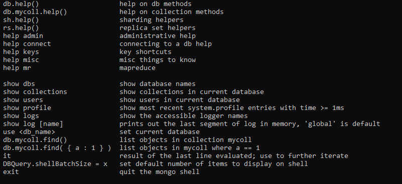
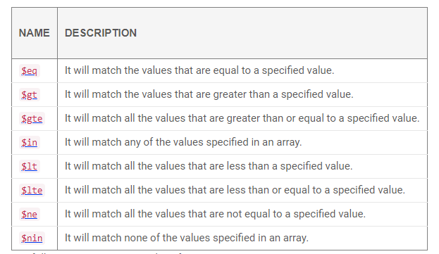

## About
### NoSql mongoDB boilerplate

```
Total documents count for collections Collection(Database(MongoClient(host=['localhost:27017'], document_class=dict, tz_aware=False, connect=True), 'coffee'), 'action') is 4

{'_id': ObjectId('60d4757ee4cb629447890aa4'),
 'barista': 'nick',
 'brew_id': 1,
 'coffee': 1,
 'qty': 1,
 'timestamp': datetime.datetime(2021, 6, 24, 20, 7, 26, 250000)}
{'_id': ObjectId('60d4757ee4cb629447890aa5'),
 'barista': 'nick',
 'brew_id': 1,
 'coffee': 1,
 'qty': 2,
 'timestamp': datetime.datetime(2021, 6, 24, 20, 7, 26, 252000)}
{'_id': ObjectId('60d4757ee4cb629447890aa6'),
 'barista': 'nick',
 'brew_id': 1,
 'coffee': 1,
 'qty': 3,
 'timestamp': datetime.datetime(2021, 6, 24, 20, 7, 26, 253000)}
{'_id': ObjectId('60d4757ee4cb629447890aa7'),
 'barista': 'nick',
 'brew_id': 1,
 'coffee': 1,
 'qty': 4,
 'timestamp': datetime.datetime(2021, 6, 24, 20, 7, 26, 254000)}
```

### Prerequisite
```
This module require mongoDB community installed on your pc either window or linux.
```

Window
```
https://www.mongodb.com/try/download/community
```

Linux
```
https://www.analyticsvidhya.com/blog/2020/02/mongodb-in-python-tutorial-for-beginners-using-pymongo/?utm_source=blog&utm_medium=NoSQL_Databases
```

### Install virtualenv
```
pip install virtualenv
```

### Create virtual env
```
virtualenv venv  
```    

### Activate the virtual environment
Mac OS / Linux
```
source venv/bin/activate
```

Windows
```
venv\Scripts\activate
```

### Install requirements.txt
```
pip install -r requirements.txt
```

### Create .env file at root directory
``` 
MONGO_HOST = localhost
MONGO_PORT = 27017
```

### Mongo Console

Show database
```
show dbs

>admin   0.000GB
>config  0.000GB
>local   0.000GB
```

Use db
```
use local

>switched to db local
```

Show collections
```
show collections

>jobs
>startup_log
```

List documents in collections
```
db.jobs.find()

> { "_id" : ObjectId("605065004a54e3548ee06fca"), "brewing_id" : "123", "coffee" : 1, "timestamp" : ISODate("2021-03-16T15:57:52.534Z") }
```
____

Other command



____

Filter Operator



____


Good to read

[Mongo Official Documentation](https://docs.mongodb.com/manual/crud/)


